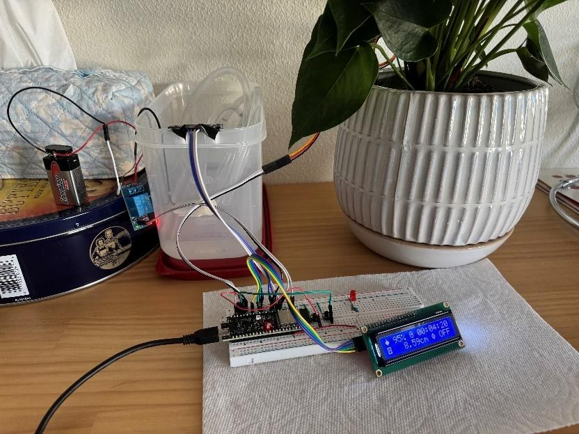
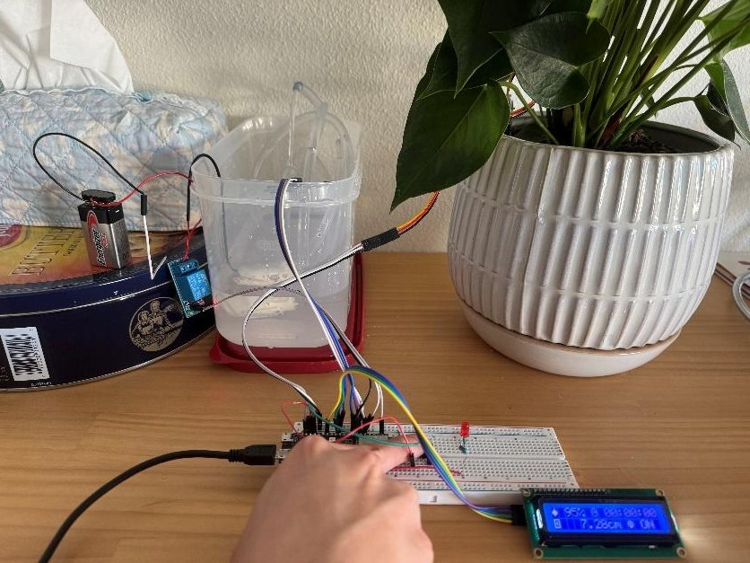
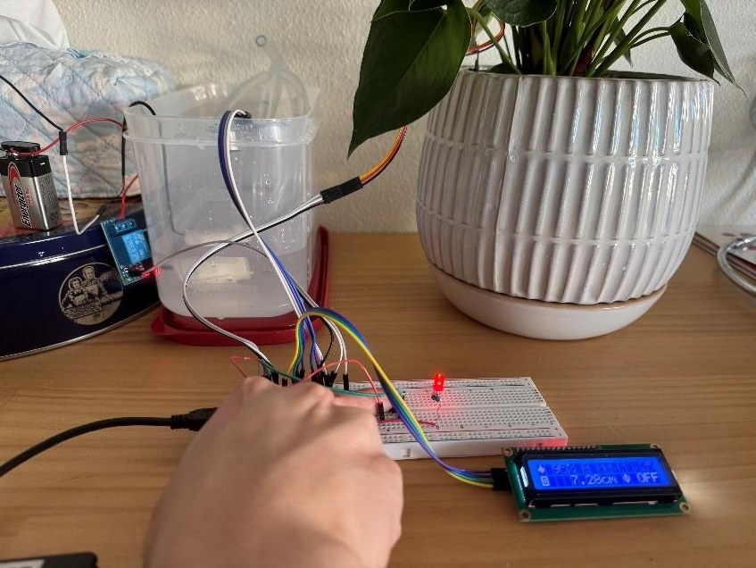
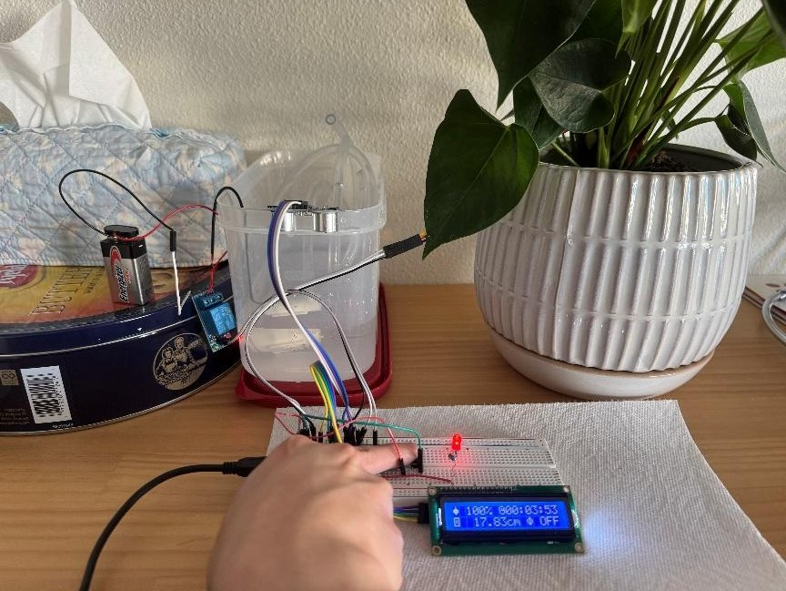
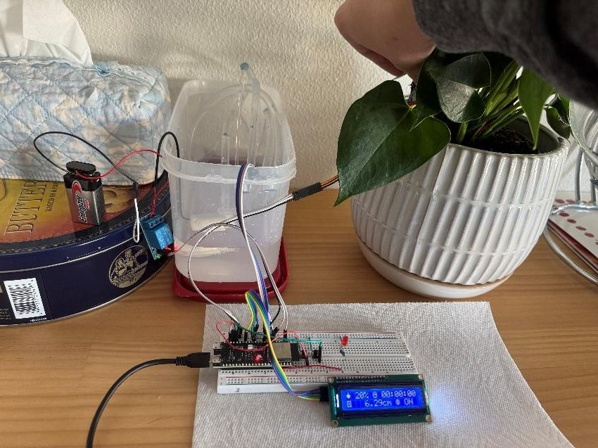
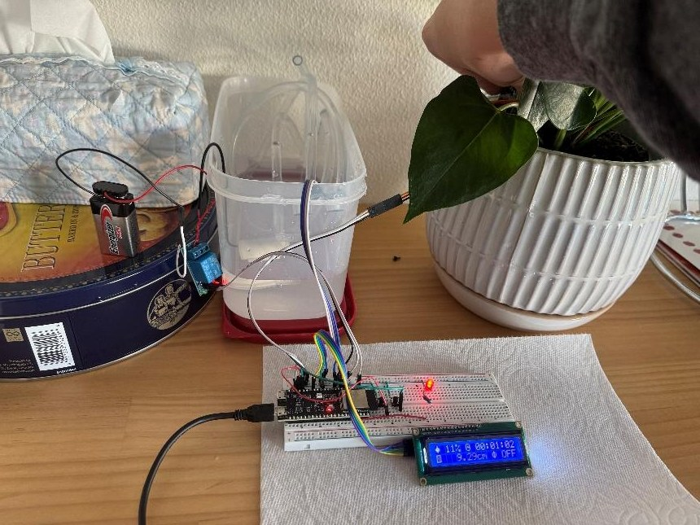
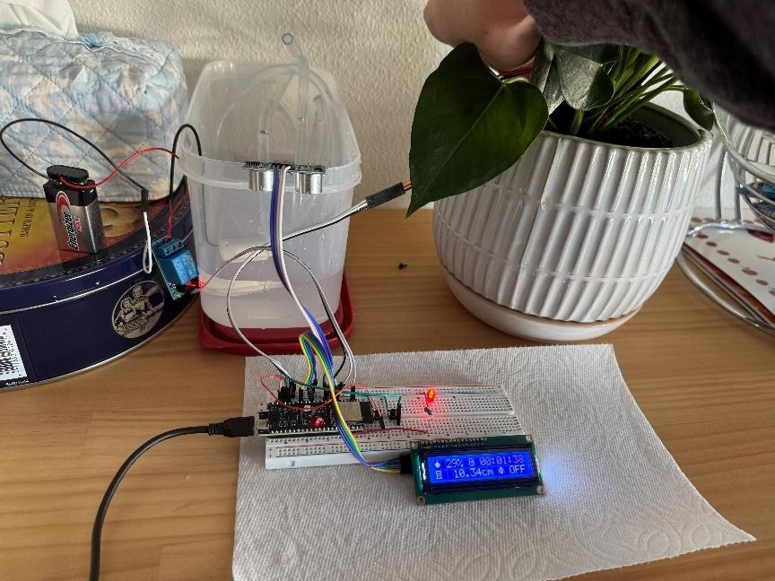

# ESP32-S3 Smart Plant Watering System

A dual-core **FreeRTOS** system on the ESP32-S3 that monitors soil moisture, waters a plant automatically, and refuses to run the pump when the water tank is empty. A 16×2 LCD shows live moisture, time since the last watering, tank level and pump state.

*Solo final project for EE/CSE 474 (Embedded Systems), University of Washington, Summer 2025. I did all of the hardware, firmware, testing and documentation myself.*



## Features

- **Automatic watering:** when soil moisture drops below 30%, the pump runs for at least 10 s, then waits 90 s for the water to soak in before checking again
- **Manual watering:** a hold-to-pump button
- **Suspend toggle:** a button that disables the pump in every mode, with an LED indicator
- **Low-tank protection:** an ultrasonic sensor measures the water level and blocks the pump so it never runs dry
- **LCD dashboard:** custom icons, an idle timer, tank distance and pump status, redrawn only when a value changes

## Architecture

```
 esp_timer 50 Hz ──► qCtrlTick ──► TaskPump (Core 1, priority 2) ──┐
                                    • soil moisture (ADC)           │ qStatus
                                    • ultrasonic tank level         │ (latest snapshot,
                                    • button debounce (~200 Hz)     │  xQueueOverwrite)
                                    • pump state machine → relay    ▼
 esp_timer 64 Hz ──► qUITick ───► TaskLCD  (Core 0, priority 1) ──► 16×2 I²C LCD
```

- **Control and display run on different cores.** Slow I²C writes to the LCD can never delay pump control.
- **Timer callbacks do the minimum.** Each one posts a single byte to a queue and wakes its task; all the real work happens in the tasks.
- **Single-slot status queue.** `TaskPump` publishes a `status_t` snapshot with `xQueueOverwrite`, so the LCD always shows the newest state and never a backlog.
- **Buttons are scanned between control ticks.** `TaskPump` waits on its tick queue with a 5 ms timeout, which gives about 200 Hz debounce sampling and still runs control at exactly 50 Hz.

### Pump priority

```
SUSPENDED (button or empty tank)  →  OFF, cancel auto cycle
else MANUAL button held           →  ON
else AUTO:  soaking               →  OFF
            moisture < 30%        →  ON for ≥ 10 s, then soak 90 s
            otherwise             →  OFF
```

## Test cases

| Mode | Result | |
|---|---|---|
| Manual watering | Pump runs while the button is held |  |
| Manual + suspended | Suspend overrides manual; pump stays off |  |
| Manual + low tank | Empty tank overrides manual; LED on |  |
| Auto watering | Below 30% triggers a 10 s burst |  |
| Auto + suspended | Suspend overrides auto |  |
| Auto + low tank | Empty tank stops the pump immediately |  |

## Hardware

| Part | Pin(s) |
|---|---|
| ESP32-S3 | — |
| Capacitive soil moisture sensor | GPIO 14 (ADC, 11 dB attenuation) |
| Relay module (active-LOW) + water pump | GPIO 16 |
| HC-SR04 ultrasonic sensor | TRIG 6, ECHO 7 |
| Manual / suspend buttons (internal pull-ups) | GPIO 12 / GPIO 13 |
| Status LED | GPIO 1 |
| 16×2 I²C LCD (0x27) | SDA 8, SCL 9 |

## Engineering challenges

- **Relay stuck on:** driving the relay input from 5 V kept the pump permanently on. Switching to 3.3 V logic levels fixed it.
- **Unreliable moisture readings:** a resistive probe drifted with soil composition and corrosion. A capacitive sensor gave stable values.
- **Board failure:** water damaged the ESP32-S3 partway through. I ported the firmware to an Arduino Mega 2560 so I could keep testing the remaining features.

## Notes and possible improvements

- The timers use `ESP_TIMER_TASK` dispatch, so the callbacks run in the esp_timer task, not in a true hardware ISR. Switching to `ESP_TIMER_ISR`, or to task-context queue calls, would match the API to the context.
- `pulseIn()` can block for up to 15 ms of each 20 ms control cycle when no echo comes back. Reading the tank level less often (the HC-SR04 recommends at least 60 ms between pings) or timing the echo with interrupts would free up the loop.
- The auto-cycle timers compare `millis()` values directly, so they would misbehave when the counter wraps after about 49 days. Comparing elapsed time (`now - start >= duration`) avoids this.
- Possible additions: Wi-Fi monitoring, plus temperature, humidity and light sensing.

## Repository

```
FinalProject/FinalProject.ino   Firmware (Arduino-ESP32 + FreeRTOS)
Doxyfile_Arduino                Doxygen configuration
docs/html/                      Generated code documentation (open index.html)
docs/PlantWatering_Report.pdf   Final report
images/                         Test photos
```

**Build:** Arduino IDE with the ESP32 board package. Select an ESP32-S3 board and install the `LiquidCrystal_I2C` library.
